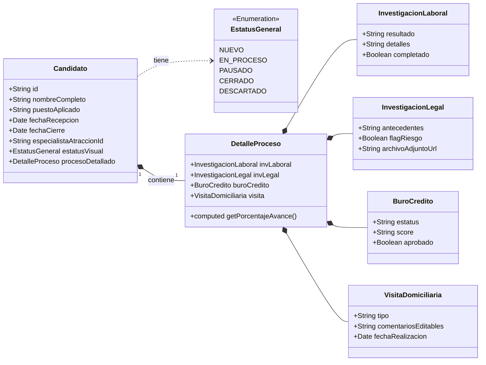

# SPEC — Dashboard de Clientes (Nivel 1/2)

## Objetivo
Estandarizar datos y UI del panel de clientes para mostrar avance granular por candidato/proceso (semáforo + drill-down).

## Campos requeridos (vista cliente)

| Campo | Tipo sugerido | Notas de negocio |
| --- | --- | --- |
| Nombre del Candidato | string | Nombre completo. |
| Puesto | string | Vacante aplicando. |
| Fecha de Recepción | date | Inicio del proceso. |
| Fecha de Cierre | date | Fin (manual o calculado). |
| Especialista de Atracción | string / FK users | **Nuevo**. Responsable en la cuenta. |
| Investigación Laboral | objeto estado | ej. “Historial positivo”, detalles, completado. |
| Investigacion Legal | objeto estado | **Nuevo**. Antecedentes, flag riesgo, adjunto URL. |
| Buró de Crédito | objeto estado | **Nuevo**. estatus (“Sin registro”, “Aprobado”), score, aprobado. |
| Visita Domiciliaria/Virtual | objeto | tipo (virtual/presencial), comentarios editables, fecha realización. |
| Status General | enum | `nuevo|en_proceso|pausado|cerrado|descartado`. |
| % Avance (calculado) | number | Derivado de completado de sub-bloques. |

## Diagrama de datos (Mermaid)

## Implicaciones de modelo (Drizzle/MySQL)
- Añadir a `processes` o `candidates`:
  - `especialistaAtraccionId` (FK a users) o `especialistaAtraccionNombre` (string).
  - `estatusVisual` (`enum` como EstatusGeneral).
  - `fechaCierre` (timestamp nullable).
  - Bloques JSON: `investigacionLaboral`, `investigacionLegal`, `buroCredito`, `visitaDomiciliaria` (evita crear 4 tablas nuevas en esta fase).
- Migración requerida y exponer campos en tRPC (lectura/escritura).

## UI (nivel 1/2)
- Nivel 1 (tarjeta/lista semáforo): candidato, puesto, fechas, especialista, estatus general, % avance.
- Nivel 2 (detalle expandible): secciones para Inv. Laboral, Inv. Legal, Buró, Visita con estados, tags y enlaces/adjuntos.
- Rol cliente: solo lectura (sin formularios ni mutaciones).

## Pendientes
- Definir catálogo de valores por bloque (estatus/labels) y cálculo de % avance.
- Decidir si `especialistaAtraccion` se liga a users o es texto libre.
- Coordinar con API cliente para campos que serán editables desde la vista cliente.
