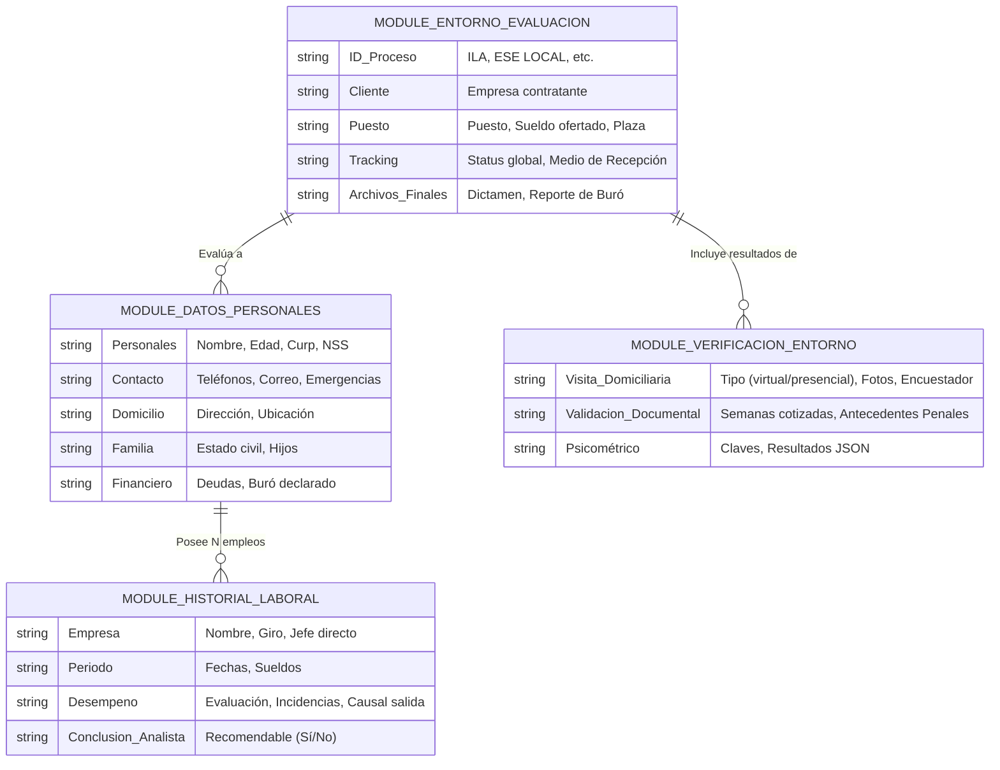

# 📄 SPEC-003: Reordenamiento y Flujo Estructurado de Captura de Información (Analista)

## 1. Identificación y Documento
* **ID:** ARCH-20260311-01
* **Nombre:** Reordenamiento y Flujo Estructurado de Captura de Información (Analista)
* **Fecha:** 11 Marzo 2026

## 2. Contexto y Problema Actual
Lola de Sinergia ha identificado que, aunque el sistema captura **toda** la información requerida para el cliente final, el proceso para los analistas es **desordenado, redundante y no guiado**.

**Observaciones de Redundancia Actuales en el Modelo de Datos (`schema.ts`):**
1. **Datos de la Vacante:** Roles, sueldos solicitados, y plazas están vinculados directamente al `Candidato` (p. ej. `puestoId` en `candidate`, o `plaza`, `puestoSolicitado` en `perfilDetalle`), cuando deberían pertenecer exclusivamente al **Proceso de Evaluación**, ya que un mismo candidato puede tener múltiples procesos para distintas vacantes en el tiempo.
2. **Medio de Recepción:** Existe tanto en `candidates.medioDeRecepcion` como en `processes.medioDeRecepcion`.
3. **Visión Monolítica:** Los módulos `CandidatoDetalle` y `ProcesoDetalle` concentran formularios inmensos. No hay un "Camino Seguro" (Happy Path) que un analista Junior pueda seguir paso a paso sin perderse.

---

## 3. Esquema Modular de Información (Reordenamiento)

El objetivo es separar la información en contenedores semánticamente correctos, evitando que el usuario capture lo mismo dos veces o en el lugar equivocado.

### Diagrama de Responsabilidades (Mermaid)



---

## 4. Evolución del Flujo Lógico y Trabajo del Analista (Seguimiento Guiado)

El trabajo de un analista debe ser **lineal e intuitivo**, actuando como un "Wizard" (Asistente paso a paso) en el `ProcesoDetalle`, en lugar de un lienzo en blanco.

**Flujo Analista Guiado (Paso a Paso)**:
1. **Inbox / Recepción:** Llega un requerimiento (ILA/ESE), se crea el Proceso y se asegura que el perfil básico del candidato exista.
2. **Self-Service:** El sistema envía un link al candidato para que Llene sus *Datos Personales* y *Historial Laboral* previo. El analista solo **supervisa y aprueba**.
3. **Fase de Verificación Pasiva (Bases de datos):** El analista sube/checa Semanas Cotizadas, Buró y Antecedentes Penales. Es un trabajo de escritorio.
4. **Fase de Verificación Activa (Contacto Humano):** El analista ejecuta llamadas a empresas listadas en el historial laboral y califica a los referentes. Paralelamente, se solicita una "Visita" a los encuestadores.
5. **Cierre y Dictaminación:** La IA consolida los componentes (Laboral, Entorno, Documentos). El analista evalúa la pre-sugerencia de la IA, le da su toque experto y aprueba el Dictamen final a entregar al cliente.

### Flujo Analista - Secuencia (Mermaid)

```mermaid
flowchart TD
    A[🛎️ Paso 1: Recepción del Proceso] --> B[📋 Paso 2: Recolección y Revisión de Datos (Self-Service)]
    
    B -->|Candidato Llena/Analista Verifica| G{¿Socioeconómico o Laboral?}
    
    G -->|Ambos| C[🔍 Paso 3: Verificación Documental]
    
    subgraph "Escritorio (Backoffice)"
    C --> C1(📁 Semanas Cotizadas)
    C --> C2(💳 Buró de Crédito)
    C --> C3(👮 Antecedentes Penales)
    end
    
    C --> D[📞 Paso 4: Verificación Laboral Activa]
    
    subgraph "Llamadas (Contacto)"
    D --> D1(Llamar a Referencias Laborales)
    D --> D2(Evaluar Desempeño según Matriz)
    end
    
    G -->|Solo ESE| E[🏠 Paso 5: Visita y Entorno]
    
    subgraph "Campo"
    E --> E1(Asignación a Encuestador)
    E --> E2(Fotos y Validación de Vivienda)
    end
    
    D --> F[⚖️ Paso 6: Generación de Dictamen]
    E --> F
    
    F --> F1(✨ Pre-Análisis por IA)
    F1 --> F2(📝 Ajuste experto del Analista)
    F2 --> H[🚀 Paso 7: Cierre y Entrega a Cliente]
    
    classDef step fill:#e1f5fe,stroke:#3b82f6,stroke-width:2px,color:#023e8a,font-weight:bold;
    class A,B,C,D,E,F,H step;
```

---

## 5. Justificación de los Cambios para UI/UX

Para que las pantallas actuales (`CandidatoDetalle.tsx` y `ProcesoDetalle.tsx`) dejen de ser abrumadoras, sugerimos este enfoque para SOFIA en el futuro:

1. **Stepper de Progreso:** Agregar una barra de progreso al expediente (`Recepcionado -> En Revisión -> Trabajo de Campo -> Dictamen -> Finalizado`). El UI bloqueará u ocultará fases adelantadas para enfocar al analista solo en lo que urge.
2. **Eliminar Redundancia de Puesto:** Eliminar el ingreso del "Puesto" en los tabuladores del Candidato. Esa información será "Read-Only" en la vista del candidato, sacada de su `Proceso` activo.
3. **Pestañas por Fases, no por Entidades de Base de Datos:** Actualmente las pestañas se llaman (Historial, Documentos, Perfil) y mezclan etapas de vida. Deberían llamarse según el flujo: (1. Validación Candidato, 2. Investigación Burocrática, 3. Referencias Laborales, 4. Visita, 5. Reporte).


- [ ] Presentar este documento a Lola y Cliente Final.
- [ ] Aprobar limpieza de campos duplicados en Base de Datos (ej. eliminar `medioDeRecepcion` en Candidato si ya está en Proceso).

## 5.5 Experiencia del Cliente Final (Dashboard Cliente)

Para que todo este trabajo de recolección tenga sentido, el **Cliente Final** debe consumir la información de forma ejecutiva pero **conservando el acceso al nivel de detalle máximo si lo requiere (Observación de Lola)**. Actualmente componentes como `ClienteProcesoDetalle.tsx` deben reflejar esta estructura visual progresiva:

1. **La "Portada" (Lo más importante primero):** Dictamen Final IA, Semáforo de recomendación (Apto/No Apto) y barra de progreso real (aprovechando `estatusVisual` de la BD).
2. **Ficha Ejecutiva con "Drill-Down" (Expansible):** Mostrar los datos generales del candidato en bloques limpios por defecto, permitiendo expandir los acordeones ('Ver Detalles') para consultar toda la data profunda familiar, de vivienda o financiera si el cliente gusta hacer doble clic en su lectura.
3. **Semáforos de Verificación Visuales y Anexos:** Mostrar íconos rápidos de validación (Buró: ✅ Verde / Penales: 🔴 Rojo), pero cada bloque debe permitir la descarga del anexo o PDF original para auditoría del cliente.
4. **Historial Laboral - Capas de Profundidad:** 
   - *Capa 1 (Por defecto):* Empresa -> Desempeño Evaluado -> Motivo de salida -> Recontratable (Sí/No).
   - *Capa 2 (Expandida):* Ver todos los comentarios específicos del ex-jefe inmediato, incidencias reportadas (inasistencias, demandas) y fechas exactas.

## 6. Siguientes Pasos (Roadmap de Implementación)
- [ ] Presentar este documento a Lola y Cliente Final.
- [ ] Aprobar limpieza de campos duplicados en Base de Datos (ej. eliminar `medioDeRecepcion` en Candidato si ya está en Proceso).
- [ ] Recrear el formulario principal bajo el modelo de "Stepper" (Wizard) en una rama nueva (`feat/reorden-ux-analista`).
