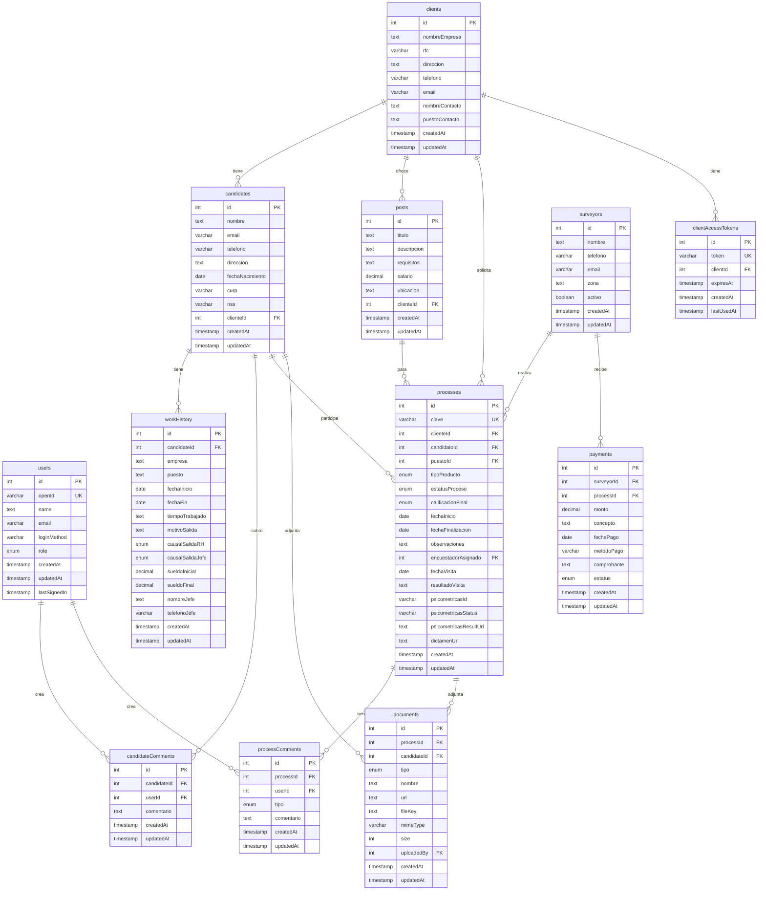

# Diagrama de Base de Datos - INTEGRA-RH

Este documento contiene el diagrama entidad-relación completo de la base de datos del sistema INTEGRA-RH.

## Diagrama ER (Entity-Relationship)



## Relaciones Principales

### Clientes (clients)
Un cliente empresarial puede tener:
- Múltiples candidatos asociados
- Múltiples puestos de trabajo ofrecidos
- Múltiples procesos de evaluación
- Múltiples tokens de acceso al portal

### Candidatos (candidates)
Un candidato puede tener:
- Un historial laboral completo (múltiples empleos)
- Múltiples comentarios internos
- Participación en múltiples procesos
- Documentos adjuntos (CV, identificaciones)

### Procesos (processes)
Un proceso vincula:
- Un cliente (quien solicita)
- Un candidato (quien es evaluado)
- Un puesto (para qué posición)
- Un encuestador (quien realiza visita)
- Comentarios y bitácora
- Documentos y evidencias

### Usuarios (users)
Los usuarios administradores pueden:
- Crear comentarios sobre candidatos
- Crear comentarios sobre procesos
- Subir documentos

## Enumeraciones (ENUMs)

### role (users)
- `user`: Usuario regular
- `admin`: Administrador con acceso completo

### tipoProducto (processes)
- `ILA`: Investigación Laboral y Análisis
- `ESE LOCAL`: Estudio Socioeconómico Local
- `ESE FORANEO`: Estudio Socioeconómico Foráneo
- `VISITA LOCAL`: Visita Domiciliaria Local
- `VISITA FORANEA`: Visita Domiciliaria Foránea
- `ILA CON BURÓ DE CRÉDITO`
- `ESE LOCAL CON BURÓ DE CRÉDITO`
- `ESE FORANEO CON BURÓ DE CRÉDITO`
- `ILA CON INVESTIGACIÓN LEGAL`
- `ESE LOCAL CON INVESTIGACIÓN LEGAL`
- `ESE FORANEO CON INVESTIGACIÓN LEGAL`
- `BURÓ DE CRÉDITO`
- `INVESTIGACIÓN LEGAL`
- `SEMANAS COTIZADAS`

### estatusProceso (processes)
- `en_recepcion`: Proceso recién creado
- `en_verificacion`: Verificando datos del candidato
- `en_proceso`: Evaluación en curso
- `en_visita`: Visita domiciliaria programada/en curso
- `en_revision`: Revisión final de resultados
- `finalizado`: Proceso completado
- `entregado`: Dictamen entregado al cliente
- `cancelado`: Proceso cancelado

### calificacionFinal (processes)
- `recomendable`: Candidato recomendado sin reservas
- `recomendable_con_reservas`: Recomendado con observaciones
- `no_recomendable`: No recomendado para el puesto
- `pendiente`: Aún no se ha emitido calificación

### causalSalidaRH y causalSalidaJefe (workHistory)
- `RENUNCIA VOLUNTARIA`
- `TÉRMINO DE CONTRATO`
- `CIERRE DE LA EMPRESA`
- `JUBILACIÓN`
- `ABANDONO DE TRABAJO`
- `ACUMULACIÓN DE FALTAS`
- `BAJO DESEMPEÑO`
- `FALTA DE PROBIDAD`
- `VIOLACIÓN AL CÓDIGO DE CONDUCTA`
- `ABUSO DE CONFIANZA`
- `INCUMPLIMIENTO A POLÍTICAS Y PROCESOS`

### tipo (processComments)
- `comentario`: Comentario general
- `cambio_estatus`: Registro de cambio de estatus
- `asignacion`: Registro de asignación
- `resultado`: Registro de resultado

### tipo (documents)
- `cv`: Curriculum Vitae
- `identificacion`: Identificación oficial
- `comprobante_domicilio`: Comprobante de domicilio
- `evidencia_visita`: Evidencias de visita domiciliaria
- `dictamen`: Dictamen final
- `otro`: Otro tipo de documento

### estatus (payments)
- `pendiente`: Pago pendiente
- `pagado`: Pago realizado
- `cancelado`: Pago cancelado

## Índices Recomendados

Para optimizar el rendimiento en producción, se recomienda crear los siguientes índices:

```sql
-- Búsqueda de procesos por cliente
CREATE INDEX idx_processes_clienteId ON processes(clienteId);

-- Búsqueda de candidatos por cliente
CREATE INDEX idx_candidates_clienteId ON candidates(clienteId);

-- Búsqueda de procesos por candidato
CREATE INDEX idx_processes_candidatoId ON processes(candidatoId);

-- Búsqueda de procesos por estatus
CREATE INDEX idx_processes_estatusProceso ON processes(estatusProceso);

-- Búsqueda de tokens válidos
CREATE INDEX idx_tokens_expiresAt ON clientAccessTokens(expiresAt);

-- Búsqueda de procesos por clave
CREATE INDEX idx_processes_clave ON processes(clave);

-- Búsqueda de historial laboral por candidato
CREATE INDEX idx_workHistory_candidateId ON workHistory(candidateId);

-- Búsqueda de comentarios por proceso
CREATE INDEX idx_processComments_processId ON processComments(processId);

-- Búsqueda de documentos por proceso
CREATE INDEX idx_documents_processId ON documents(processId);
```

## Consideraciones de Diseño

### Normalización
La base de datos está normalizada en tercera forma normal (3NF) para evitar redundancia y mantener integridad de datos.

### Timestamps
Todas las tablas incluyen `createdAt` y `updatedAt` para auditoría y trazabilidad.

### Soft Deletes
Actualmente no se implementan soft deletes. Los registros se eliminan físicamente de la base de datos. Para implementar soft deletes en el futuro, agregar campo `deletedAt` a las tablas principales.

### Claves Foráneas
Todas las relaciones están definidas mediante claves foráneas con restricciones de integridad referencial.

### Unicidad
Los campos que requieren unicidad están marcados con `UNIQUE`:
- `users.openId`: Un usuario de Manus OAuth es único
- `processes.clave`: Cada proceso tiene una clave única
- `clientAccessTokens.token`: Cada token es único

---

**Autor:** Manus AI  
**Fecha:** 31 de Octubre, 2025  
**Versión:** 1.0
