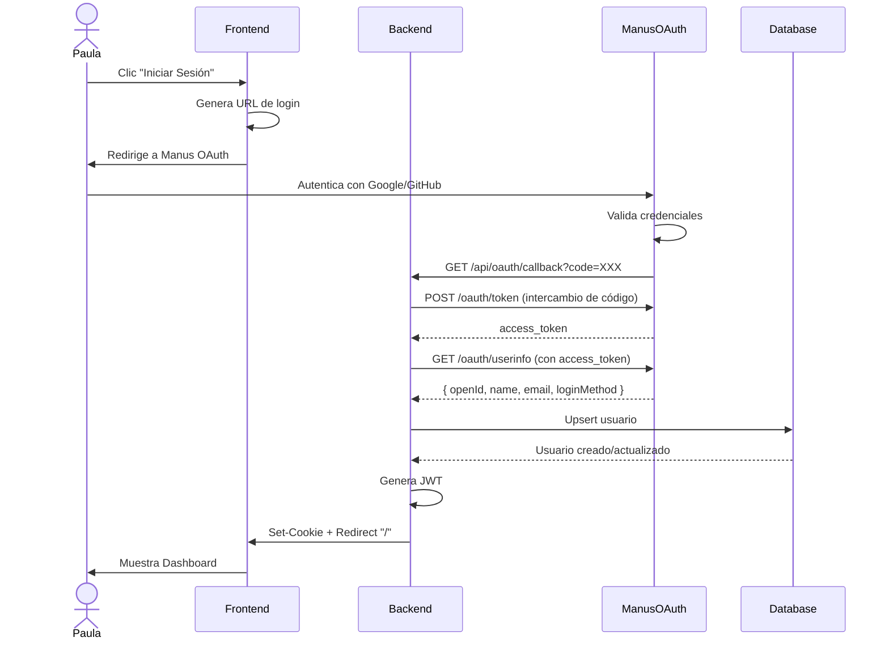
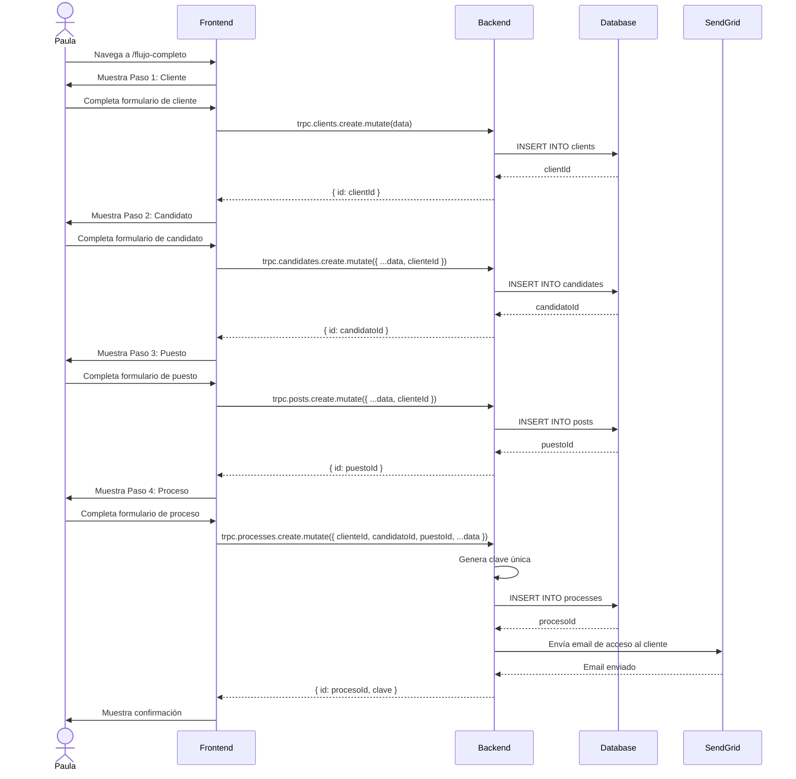
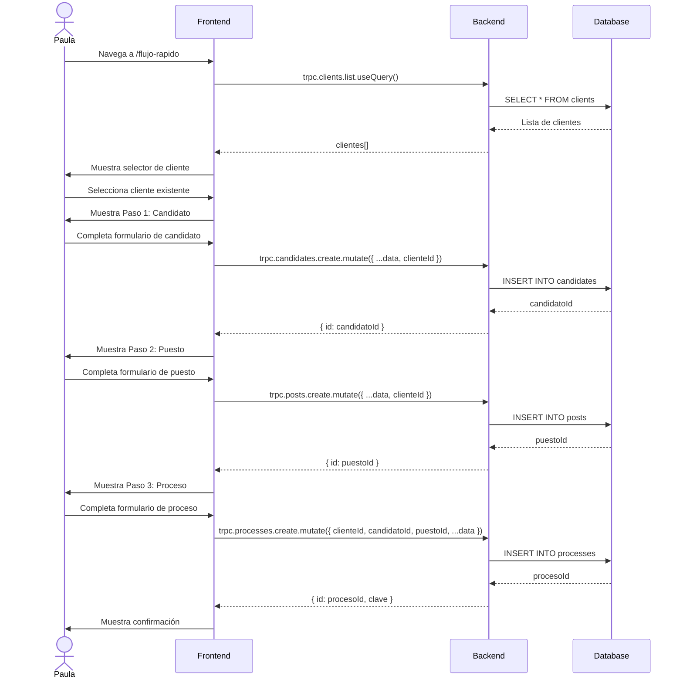
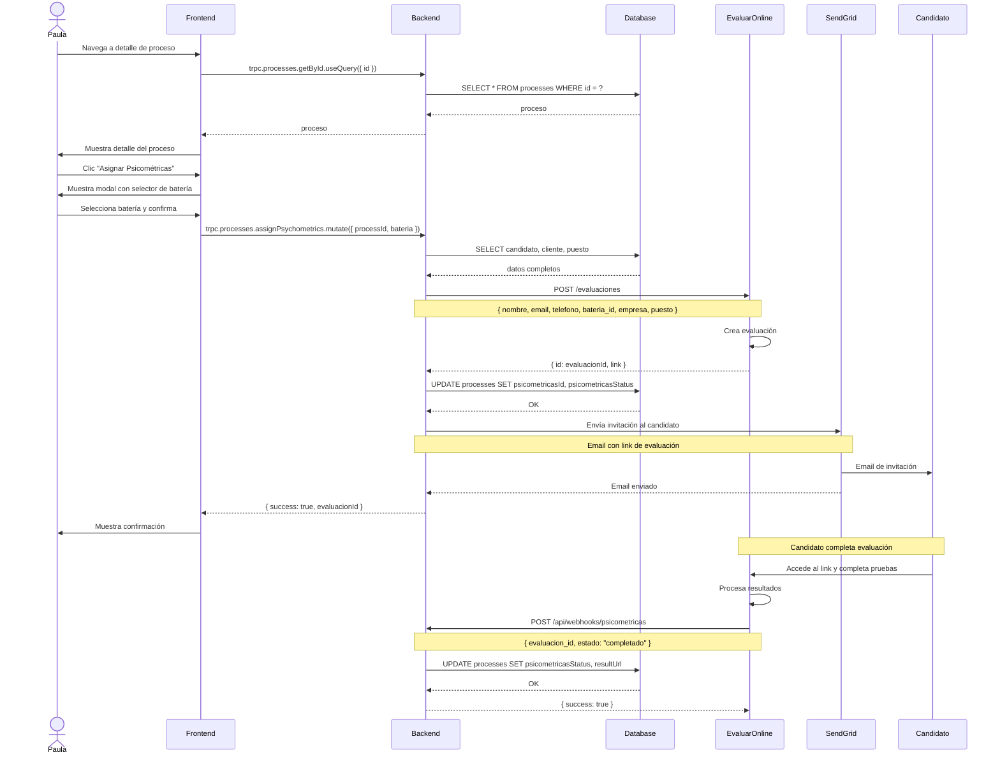
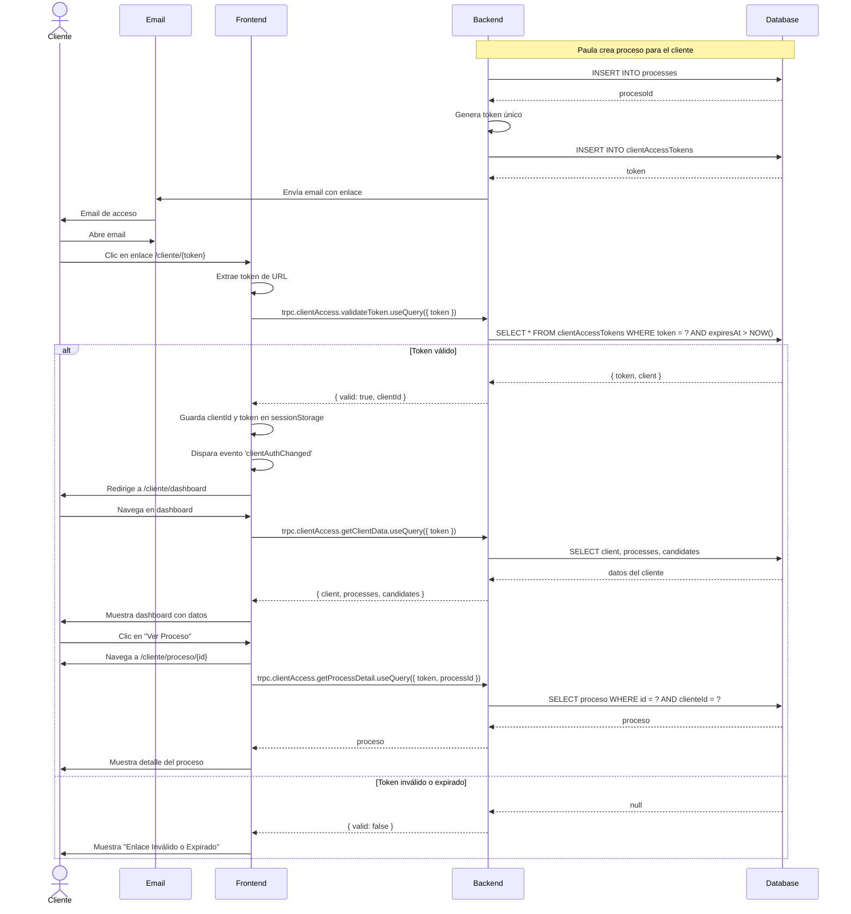
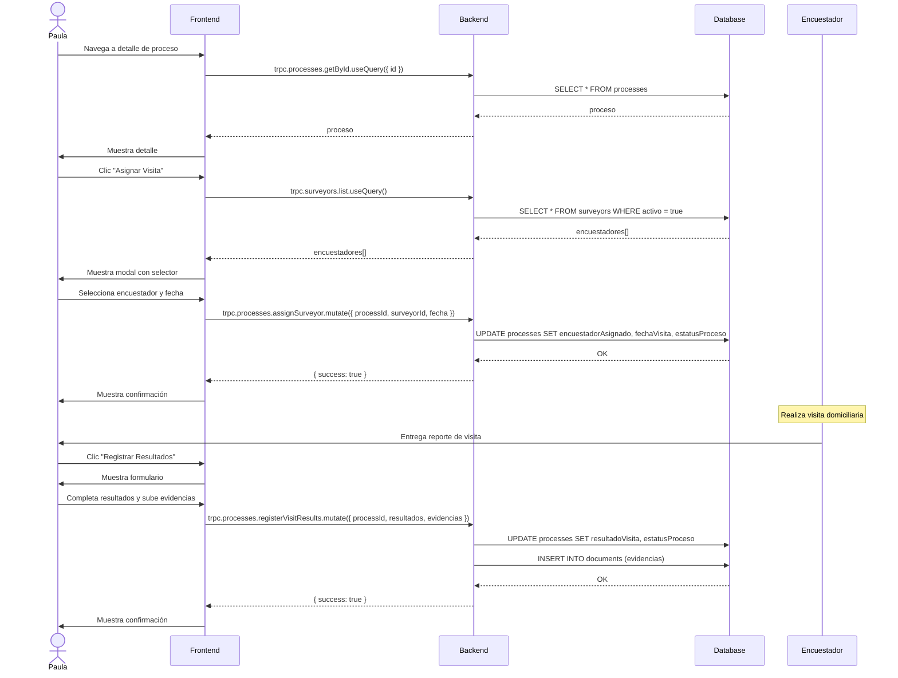
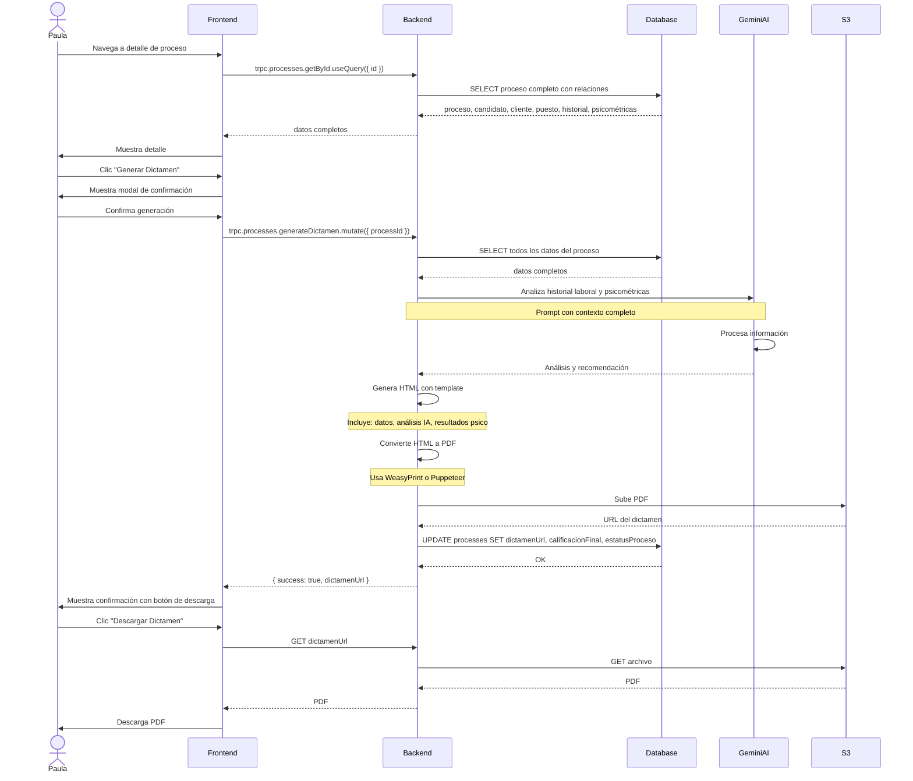

# Flujos de Trabajo - INTEGRA-RH

Este documento describe los flujos de trabajo implementados en el sistema INTEGRA-RH, con diagramas de secuencia y explicaciones detalladas.

## Tabla de Contenidos

1. [Flujo de Autenticación de Administradores](#flujo-de-autenticación-de-administradores)
2. [Flujo Completo de Creación](#flujo-completo-de-creación)
3. [Flujo Rápido de Creación](#flujo-rápido-de-creación)
4. [Flujo de Asignación de Psicométricas](#flujo-de-asignación-de-psicométricas)
5. [Flujo de Portal de Clientes](#flujo-de-portal-de-clientes)
6. [Flujo de Visita Domiciliaria](#flujo-de-visita-domiciliaria)
7. [Flujo de Generación de Dictamen](#flujo-de-generación-de-dictamen)

---

## 1. Flujo de Autenticación de Administradores

### Descripción
Los administradores (Paula y futuros usuarios) se autentican mediante Manus OAuth, que soporta múltiples proveedores (Google, GitHub, etc.).

### Diagrama de Secuencia



### Pasos Detallados

**Paso 1: Inicio de sesión**
- Paula hace clic en "Iniciar Sesión" en la página principal
- Frontend genera URL usando `getLoginUrl()` de `client/src/const.ts`
- URL incluye `redirect_uri` apuntando a `/api/oauth/callback`

**Paso 2: Autenticación externa**
- Paula es redirigida al portal de Manus OAuth
- Selecciona proveedor (Google, GitHub, etc.)
- Completa autenticación con el proveedor
- Manus OAuth valida credenciales

**Paso 3: Callback y token**
- Manus OAuth redirige a `/api/oauth/callback?code=XXX`
- Backend intercambia código por `access_token`
- Backend usa `access_token` para obtener información del usuario

**Paso 4: Creación/actualización de usuario**
- Backend busca usuario por `openId` en base de datos
- Si existe, actualiza `lastSignedIn` y otros campos
- Si no existe, crea nuevo usuario
- Si el `openId` coincide con `OWNER_OPEN_ID`, asigna rol `admin`

**Paso 5: Sesión**
- Backend genera JWT con `{ openId }`
- JWT se guarda en cookie `HttpOnly` con duración de 30 días
- Backend redirige a `/` (dashboard)

**Paso 6: Acceso a recursos**
- Frontend incluye cookie automáticamente en todas las requests
- Backend valida JWT en cada request a tRPC
- Si JWT es válido, inyecta `user` en contexto
- Procedimientos protegidos verifican existencia de `user`

### Código Relevante

**Generación de URL de login:**
```typescript
// client/src/const.ts
export function getLoginUrl() {
  const redirectUri = `${window.location.origin}/api/oauth/callback`;
  return `${VITE_OAUTH_PORTAL_URL}?redirect_uri=${encodeURIComponent(redirectUri)}`;
}
```

**Callback de OAuth:**
```typescript
// server/_core/oauth.ts
app.get('/api/oauth/callback', async (req, res) => {
  const { code } = req.query;
  
  // Intercambiar código por token
  const tokenResponse = await fetch(`${OAUTH_SERVER_URL}/oauth/token`, {
    method: 'POST',
    headers: { 'Content-Type': 'application/json' },
    body: JSON.stringify({
      code,
      client_id: ENV.appId,
      redirect_uri: `${req.protocol}://${req.get('host')}/api/oauth/callback`,
    }),
  });
  
  const { access_token } = await tokenResponse.json();
  
  // Obtener información del usuario
  const userResponse = await fetch(`${OAUTH_SERVER_URL}/oauth/userinfo`, {
    headers: { 'Authorization': `Bearer ${access_token}` },
  });
  
  const userData = await userResponse.json();
  
  // Upsert usuario
  await upsertUser({
    openId: userData.openId,
    name: userData.name,
    email: userData.email,
    loginMethod: userData.loginMethod,
    lastSignedIn: new Date(),
  });
  
  // Generar JWT
  const token = jwt.sign({ openId: userData.openId }, ENV.jwtSecret, {
    expiresIn: '30d',
  });
  
  // Guardar en cookie
  res.cookie(COOKIE_NAME, token, getSessionCookieOptions(req));
  
  // Redirigir a dashboard
  res.redirect('/');
});
```

**Hook de autenticación:**
```typescript
// client/src/_core/hooks/useAuth.ts
export function useAuth() {
  const { data: user, isLoading, error } = trpc.auth.me.useQuery();
  const logoutMutation = trpc.auth.logout.useMutation();
  
  return {
    user,
    loading: isLoading,
    error,
    isAuthenticated: !!user,
    logout: () => logoutMutation.mutate(),
  };
}
```

---

## 2. Flujo Completo de Creación

### Descripción
Flujo para crear todas las entidades necesarias en una sola sesión: Cliente → Candidato → Puesto → Proceso. Ideal para nuevos clientes.

### Diagrama de Secuencia



### Pasos Detallados

**Paso 1: Información del Cliente**
- Campos: nombre empresa, RFC, dirección, teléfono, email, contacto, puesto contacto
- Validación en tiempo real
- Al enviar, se crea registro en tabla `clients`
- Frontend guarda `clientId` en estado local
- Avanza automáticamente a Paso 2

**Paso 2: Información del Candidato**
- Campos: nombre, email, teléfono, dirección, fecha nacimiento, CURP, NSS
- Campo `clienteId` pre-cargado (no editable)
- Al enviar, se crea registro en tabla `candidates`
- Frontend guarda `candidatoId` en estado local
- Avanza automáticamente a Paso 3

**Paso 3: Información del Puesto**
- Campos: título, descripción, requisitos, salario, ubicación
- Campo `clienteId` pre-cargado (no editable)
- Al enviar, se crea registro en tabla `posts`
- Frontend guarda `puestoId` en estado local
- Avanza automáticamente a Paso 4

**Paso 4: Información del Proceso**
- Campos: tipo de producto (14 opciones), fecha inicio, observaciones
- Campos `clienteId`, `candidatoId`, `puestoId` pre-cargados (no editables)
- Backend genera clave única usando patrón `{TIPO}-{AÑO}-{CONSECUTIVO}`
- Al enviar, se crea registro en tabla `processes`
- Backend genera token de acceso para el cliente
- Backend envía email al cliente con enlace de acceso
- Frontend muestra confirmación con resumen

**Paso 5: Confirmación**
- Muestra resumen de todas las entidades creadas
- Muestra clave del proceso generada
- Botón "Ir al Dashboard" para volver al inicio
- Botón "Ver Proceso" para ir al detalle del proceso

### Código Relevante

**Componente principal:**
```typescript
// client/src/pages/ClienteFormularioIntegrado.tsx
export default function ClienteFormularioIntegrado() {
  const [step, setStep] = useState(1);
  const [clienteId, setClienteId] = useState<number | null>(null);
  const [candidatoId, setCandidatoId] = useState<number | null>(null);
  const [puestoId, setPuestoId] = useState<number | null>(null);
  const [procesoId, setProcesoId] = useState<number | null>(null);
  
  const createClient = trpc.clients.create.useMutation({
    onSuccess: (data) => {
      setClienteId(data.id);
      setStep(2);
      toast.success('Cliente creado exitosamente');
    },
    onError: (error) => {
      toast.error(error.message);
    },
  });
  
  // ... más mutations
  
  return (
    <DashboardLayout>
      <div className="p-6">
        <h1>Flujo Completo de Creación</h1>
        
        {/* Indicador de progreso */}
        <div className="flex items-center justify-between mb-8">
          <Step number={1} title="Cliente" active={step === 1} completed={step > 1} />
          <Step number={2} title="Candidato" active={step === 2} completed={step > 2} />
          <Step number={3} title="Puesto" active={step === 3} completed={step > 3} />
          <Step number={4} title="Proceso" active={step === 4} completed={step > 4} />
          <Step number={5} title="Confirmación" active={step === 5} completed={false} />
        </div>
        
        {/* Formularios */}
        {step === 1 && <ClienteForm onSubmit={createClient.mutate} />}
        {step === 2 && <CandidatoForm clienteId={clienteId!} onSubmit={createCandidate.mutate} />}
        {step === 3 && <PuestoForm clienteId={clienteId!} onSubmit={createPost.mutate} />}
        {step === 4 && (
          <ProcesoForm
            clienteId={clienteId!}
            candidatoId={candidatoId!}
            puestoId={puestoId!}
            onSubmit={createProcess.mutate}
          />
        )}
        {step === 5 && <Confirmacion procesoId={procesoId!} />}
      </div>
    </DashboardLayout>
  );
}
```

**Generación de clave única:**
```typescript
// server/db.ts
export async function getNextConsecutive(
  tipoProducto: TipoProducto,
  year: number
): Promise<number> {
  const db = await getDb();
  if (!db) return 1;
  
  const result = await db
    .select({ clave: processes.clave })
    .from(processes)
    .where(
      and(
        like(processes.clave, `${tipoProducto}-${year}-%`),
        eq(processes.tipoProducto, tipoProducto)
      )
    )
    .orderBy(desc(processes.clave))
    .limit(1);
  
  if (result.length === 0) return 1;
  
  const lastClave = result[0].clave;
  const parts = lastClave.split('-');
  const consecutivo = parseInt(parts[parts.length - 1]);
  return consecutivo + 1;
}

// En el router de procesos
const year = new Date().getFullYear();
const consecutivo = await getNextConsecutive(input.tipoProducto, year);
const clave = `${input.tipoProducto}-${year}-${consecutivo.toString().padStart(3, '0')}`;
```

---

## 3. Flujo Rápido de Creación

### Descripción
Flujo optimizado para crear proceso con cliente existente: Candidato → Puesto → Proceso. Omite la creación de cliente.

### Diagrama de Secuencia



### Ventajas del Flujo Rápido

- **Menos pasos:** 4 pasos en lugar de 5
- **Más rápido:** Omite formulario de cliente
- **Ideal para clientes recurrentes:** Empresas que solicitan múltiples evaluaciones
- **Reduce errores:** No hay duplicación de clientes

### Cuándo Usar Cada Flujo

| Situación | Flujo Recomendado |
|-----------|-------------------|
| Nuevo cliente empresarial | Flujo Completo |
| Cliente existente con nuevo candidato | Flujo Rápido |
| Cliente existente con candidato y puesto nuevos | Flujo Rápido |
| Puesto existente con nuevo candidato | Flujo desde Puesto |

---

## 4. Flujo de Asignación de Psicométricas

### Descripción
Flujo para asignar batería de pruebas psicométricas a un candidato mediante integración con Evaluar.Online.

### Diagrama de Secuencia



### Pasos Detallados

**Paso 1: Asignación**
- Paula navega al detalle de un proceso
- Hace clic en botón "Asignar Psicométricas"
- Selecciona batería de pruebas del catálogo
- Confirma asignación

**Paso 2: Creación en Evaluar.Online**
- Backend obtiene datos completos del proceso (candidato, cliente, puesto)
- Backend llama a API de Evaluar.Online: `POST /evaluaciones`
- Evaluar.Online crea la evaluación y retorna `evaluacionId` y `link`
- Backend guarda `evaluacionId` en campo `psicometricasId` del proceso
- Backend actualiza `psicometricasStatus` a `"asignado"`

**Paso 3: Notificación al Candidato**
- Backend genera email con template personalizado
- Email incluye:
  - Nombre del candidato
  - Nombre de la empresa
  - Nombre del puesto
  - Link directo a la evaluación
  - Instrucciones
- Backend envía email mediante SendGrid
- Candidato recibe invitación en su bandeja

**Paso 4: Candidato Completa Evaluación**
- Candidato hace clic en el link del email
- Accede a plataforma de Evaluar.Online
- Completa las pruebas psicométricas
- Evaluar.Online procesa resultados

**Paso 5: Webhook de Resultados**
- Evaluar.Online detecta que la evaluación está completa
- Envía webhook a `POST /api/webhooks/psicometricas`
- Payload incluye `evaluacion_id` y `estado: "completado"`
- Backend busca proceso por `psicometricasId`
- Backend actualiza `psicometricasStatus` a `"completado"`
- Backend guarda URL del reporte en `psicometricasResultUrl`

**Paso 6: Descarga de Resultados**
- Paula puede ver en el detalle del proceso que los resultados están listos
- Hace clic en "Descargar Reporte"
- Backend llama a `GET /evaluaciones/{id}/reporte` de Evaluar.Online
- Evaluar.Online retorna PDF con resultados
- Backend sirve PDF al navegador de Paula

### Código Relevante

**Asignación de batería:**
```typescript
// server/lib/psicometricas.ts
export async function asignarBateria(data: {
  candidatoNombre: string;
  candidatoEmail: string;
  candidatoTelefono: string;
  bateria: string;
  empresaNombre: string;
  puestoNombre: string;
}) {
  const response = await fetch(`${API_BASE_URL}/evaluaciones`, {
    method: 'POST',
    headers: {
      'Authorization': `Bearer ${PSICOMETRICAS_TOKEN}`,
      'Content-Type': 'application/json',
    },
    body: JSON.stringify({
      nombre: data.candidatoNombre,
      email: data.candidatoEmail,
      telefono: data.candidatoTelefono,
      bateria_id: data.bateria,
      empresa: data.empresaNombre,
      puesto: data.puestoNombre,
      password: PSICOMETRICAS_PASSWORD,
    }),
  });
  
  if (!response.ok) {
    throw new Error(`Error al asignar batería: ${response.statusText}`);
  }
  
  const result = await response.json();
  return {
    evaluacionId: result.id,
    link: result.link,
  };
}
```

**Webhook de resultados:**
```typescript
// server/routers.ts (o archivo separado de webhooks)
app.post('/api/webhooks/psicometricas', async (req, res) => {
  const { evaluacion_id, estado } = req.body;
  
  console.log('[Webhook Psicométricas] Recibido:', { evaluacion_id, estado });
  
  if (estado === 'completado') {
    const db = await getDb();
    if (!db) {
      return res.status(500).json({ error: 'Database not available' });
    }
    
    // Buscar proceso por psicometricasId
    const proceso = await db
      .select()
      .from(processes)
      .where(eq(processes.psicometricasId, evaluacion_id))
      .limit(1);
    
    if (proceso.length > 0) {
      // Actualizar estado
      await db
        .update(processes)
        .set({
          psicometricasStatus: 'completado',
          psicometricasResultUrl: `${API_BASE_URL}/evaluaciones/${evaluacion_id}/reporte`,
        })
        .where(eq(processes.id, proceso[0].id));
      
      console.log('[Webhook Psicométricas] Proceso actualizado:', proceso[0].id);
    }
  }
  
  res.json({ success: true });
});
```

---

## 5. Flujo de Portal de Clientes

### Descripción
Flujo para que clientes empresariales accedan a su portal mediante enlace único, sin contraseñas.

### Diagrama de Secuencia



### Pasos Detallados

**Paso 1: Generación de Token**
- Cuando Paula crea un proceso, el sistema genera automáticamente un token de acceso
- Token es un string hexadecimal de 64 caracteres generado con `crypto.randomBytes(32)`
- Token se guarda en tabla `clientAccessTokens` con:
  - `token`: el token generado
  - `clientId`: ID del cliente asociado
  - `expiresAt`: fecha de expiración (30 días desde creación)
  - `createdAt`: fecha de creación
  - `lastUsedAt`: fecha del último uso

**Paso 2: Envío de Email**
- Sistema genera email con template HTML profesional
- Email incluye:
  - Nombre del cliente
  - Nombre de la empresa
  - Link completo: `https://app.com/cliente/{token}`
  - Instrucciones de acceso
  - Nota sobre validez de 30 días
- Email se envía mediante SendGrid al email del contacto del cliente

**Paso 3: Acceso al Portal**
- Cliente hace clic en el link del email
- Frontend extrae `token` de la URL usando `useParams()`
- Frontend llama a `trpc.clientAccess.validateToken.useQuery({ token })`
- Backend busca token en base de datos con condiciones:
  - `token` coincide
  - `expiresAt` es mayor que fecha actual (token no expirado)
- Si token es válido:
  - Backend retorna `{ valid: true, clientId }`
  - Frontend guarda `clientId` y `token` en `sessionStorage`
  - Frontend dispara evento personalizado `'clientAuthChanged'`
  - Frontend redirige a `/cliente/dashboard`
- Si token es inválido o expirado:
  - Backend retorna `{ valid: false }`
  - Frontend muestra mensaje "Enlace Inválido o Expirado"

**Paso 4: Dashboard de Cliente**
- `ClientAuthContext` detecta evento `'clientAuthChanged'`
- Contexto carga `clientId` y `token` de `sessionStorage`
- Contexto llama a `trpc.clientAccess.getClientData.useQuery({ token })`
- Backend valida token y retorna:
  - Información del cliente
  - Lista de procesos del cliente
  - Lista de candidatos del cliente
- Frontend renderiza dashboard con:
  - Estadísticas (total candidatos, procesos activos, completados)
  - Tabla de procesos con clave, candidato, tipo, estatus
  - Tabla de candidatos con nombre, email, teléfono

**Paso 5: Navegación en Portal**
- Cliente puede hacer clic en "Ver Detalle" de cualquier proceso
- Frontend navega a `/cliente/proceso/{id}`
- Frontend llama a `trpc.clientAccess.getProcessDetail.useQuery({ token, processId })`
- Backend valida que el proceso pertenece al cliente (filtro por `clienteId`)
- Backend retorna información completa del proceso
- Frontend muestra:
  - Clave del proceso
  - Información del candidato
  - Información del puesto
  - Estatus actual con badge de color
  - Calificación final (si disponible)
  - Botón "Descargar Dictamen" (si disponible)

**Paso 6: Seguridad**
- Todas las queries filtran por `clientId` para asegurar aislamiento de datos
- Token se valida en cada request
- `lastUsedAt` se actualiza cada vez que se valida el token
- Si el token expira, el cliente debe solicitar un nuevo enlace a Paula

### Código Relevante

**Generación de token:**
```typescript
// server/auth/clientTokens.ts
export async function createClientAccessToken(clientId: number): Promise<string> {
  const db = await getDb();
  if (!db) throw new Error('Database not available');
  
  const token = crypto.randomBytes(32).toString('hex');
  const expiresAt = new Date();
  expiresAt.setDate(expiresAt.getDate() + 30); // 30 días
  
  await db.insert(clientAccessTokens).values({
    token,
    clientId,
    expiresAt,
    createdAt: new Date(),
    lastUsedAt: new Date(),
  });
  
  return token;
}
```

**Validación de token:**
```typescript
// server/auth/clientTokens.ts
export async function validateClientToken(token: string) {
  const db = await getDb();
  if (!db) return null;
  
  const now = new Date();
  
  const result = await db
    .select({
      token: clientAccessTokens,
      client: clients,
    })
    .from(clientAccessTokens)
    .innerJoin(clients, eq(clientAccessTokens.clientId, clients.id))
    .where(
      and(
        eq(clientAccessTokens.token, token),
        gt(clientAccessTokens.expiresAt, now)
      )
    )
    .limit(1);
  
  if (result.length === 0) return null;
  
  // Actualizar lastUsedAt
  await db
    .update(clientAccessTokens)
    .set({ lastUsedAt: now })
    .where(eq(clientAccessTokens.token, token));
  
  return result[0].client;
}
```

**Contexto de autenticación:**
```typescript
// client/src/contexts/ClientAuthContext.tsx
export function ClientAuthProvider({ children }: { children: ReactNode }) {
  const [clientId, setClientId] = useState<number | null>(null);
  const [token, setToken] = useState<string | null>(null);
  
  useEffect(() => {
    const loadFromStorage = () => {
      const storedClientId = sessionStorage.getItem('clientId');
      const storedToken = sessionStorage.getItem('clientAccessToken');
      
      if (storedClientId && storedToken) {
        setClientId(parseInt(storedClientId));
        setToken(storedToken);
      }
    };
    
    loadFromStorage();
    
    // Escuchar evento cuando se guarda token
    window.addEventListener('clientAuthChanged', loadFromStorage);
    
    return () => {
      window.removeEventListener('clientAuthChanged', loadFromStorage);
    };
  }, []);
  
  const { data: clientData } = trpc.clientAccess.getClientData.useQuery(
    { token: token! },
    { enabled: !!token }
  );
  
  return (
    <ClientAuthContext.Provider value={{ clientId, clientData, token }}>
      {children}
    </ClientAuthContext.Provider>
  );
}
```

---

## 6. Flujo de Visita Domiciliaria

### Descripción
Flujo para asignar encuestador, programar y registrar resultados de visita domiciliaria.

**Estado:** ⏳ Parcialmente implementado (campos en BD, falta UI completa)

### Diagrama de Secuencia (Propuesto)



### Pasos Propuestos

**Paso 1: Asignación de Encuestador**
- Paula navega al detalle de un proceso
- Hace clic en botón "Asignar Visita"
- Sistema muestra modal con:
  - Selector de encuestador (filtrado por zona si aplica)
  - Selector de fecha de visita
  - Campo de observaciones
- Paula selecciona encuestador y fecha
- Sistema actualiza proceso:
  - `encuestadorAsignado` = ID del encuestador
  - `fechaVisita` = fecha programada
  - `estatusProceso` = `"en_visita"`

**Paso 2: Realización de Visita**
- Encuestador recibe notificación (email o WhatsApp)
- Encuestador realiza visita en la fecha programada
- Encuestador completa formulario de visita (puede ser externo)
- Encuestador toma fotos/evidencias
- Encuestador entrega reporte a Paula

**Paso 3: Registro de Resultados**
- Paula hace clic en "Registrar Resultados"
- Sistema muestra formulario con:
  - Área de texto para resultados
  - Uploader de evidencias (fotos, documentos)
  - Selector de estatus siguiente
- Paula completa formulario
- Sistema actualiza proceso:
  - `resultadoVisita` = texto con resultados
  - `estatusProceso` = siguiente estatus (ej: `"en_revision"`)
- Sistema guarda evidencias en S3
- Sistema crea registros en tabla `documents` con tipo `"evidencia_visita"`

**Paso 4: Registro de Pago**
- Paula navega a sección "Pagos"
- Hace clic en "Registrar Pago"
- Sistema muestra formulario con:
  - Selector de encuestador
  - Selector de proceso (opcional)
  - Monto
  - Concepto
  - Fecha de pago
  - Método de pago
  - Uploader de comprobante
- Paula completa formulario
- Sistema crea registro en tabla `payments`
- Sistema guarda comprobante en S3

### Implementación Pendiente

Para completar este flujo, se necesita:

1. **UI de asignación de encuestador:**
   - Modal con selector de encuestador
   - Selector de fecha con calendario
   - Validación de disponibilidad

2. **UI de registro de resultados:**
   - Formulario con área de texto
   - Uploader de archivos con drag & drop
   - Preview de evidencias antes de subir

3. **Integración con S3:**
   - Subida de evidencias
   - Generación de URLs firmadas
   - Almacenamiento de metadata en BD

4. **Notificaciones:**
   - Email al encuestador cuando se asigna
   - Recordatorio 1 día antes de la visita
   - Notificación a Paula cuando se completa

---

## 7. Flujo de Generación de Dictamen

### Descripción
Flujo para generar dictamen final en PDF con análisis automático mediante IA.

**Estado:** ❌ No implementado

### Diagrama de Secuencia (Propuesto)



### Pasos Propuestos

**Paso 1: Recopilación de Datos**
- Sistema obtiene todos los datos del proceso:
  - Información del candidato
  - Historial laboral completo
  - Resultados de psicométricas
  - Resultados de visita domiciliaria
  - Documentos adjuntos
  - Comentarios internos

**Paso 2: Análisis con IA**
- Sistema envía prompt a Gemini AI con contexto completo
- Prompt incluye:
  - Resumen del historial laboral
  - Resultados de psicométricas (si disponibles)
  - Resultados de visita (si disponibles)
  - Requisitos del puesto
- IA retorna:
  - Resumen profesional del candidato
  - Fortalezas identificadas
  - Áreas de atención
  - Recomendación (recomendable, con reservas, no recomendable)
  - Justificación de la recomendación

**Paso 3: Generación de HTML**
- Sistema usa template HTML profesional
- Template incluye secciones:
  - Header con logo y datos del cliente
  - Información del candidato
  - Información del puesto
  - Resumen ejecutivo (generado por IA)
  - Historial laboral detallado
  - Resultados de psicométricas
  - Resultados de visita domiciliaria
  - Análisis y recomendación final
  - Firma digital de Paula
  - Footer con fecha y clave del proceso

**Paso 4: Conversión a PDF**
- Sistema convierte HTML a PDF usando WeasyPrint o Puppeteer
- PDF incluye:
  - Estilos profesionales
  - Saltos de página apropiados
  - Gráficas de psicométricas (si disponibles)
  - Fotos de visita (si disponibles)

**Paso 5: Almacenamiento**
- Sistema sube PDF a S3
- Nombre del archivo: `dictamen-{clave}-{timestamp}.pdf`
- Sistema guarda URL en campo `dictamenUrl` del proceso
- Sistema actualiza `calificacionFinal` según análisis de IA
- Sistema actualiza `estatusProceso` a `"finalizado"`

**Paso 6: Notificación**
- Sistema envía email al cliente con enlace al dictamen
- Cliente puede descargar dictamen desde su portal
- Paula puede descargar dictamen desde el detalle del proceso

### Implementación Pendiente

Para completar este flujo, se necesita:

1. **Template HTML de dictamen:**
   - Diseño profesional
   - Secciones bien definidas
   - Estilos CSS inline para PDF

2. **Integración con Gemini AI:**
   - Prompt engineering para análisis
   - Manejo de respuestas
   - Fallback si IA no está disponible

3. **Conversión HTML a PDF:**
   - Configuración de WeasyPrint o Puppeteer
   - Manejo de imágenes y gráficas
   - Optimización de tamaño de archivo

4. **Almacenamiento en S3:**
   - Subida de PDF
   - Generación de URL pública
   - Metadata en base de datos

5. **Preview antes de generar:**
   - Vista previa del HTML
   - Opción de editar antes de finalizar
   - Regeneración si es necesario

---

## Conclusión

Este documento describe los flujos de trabajo principales del sistema INTEGRA-RH. Los flujos implementados (1-5) están operativos y probados. Los flujos propuestos (6-7) requieren implementación adicional pero tienen la arquitectura y base de datos preparadas.

**Flujos Completados:**
- ✅ Autenticación de administradores
- ✅ Flujo completo de creación
- ✅ Flujo rápido de creación
- ✅ Asignación de psicométricas
- ⏳ Portal de clientes (con bug pendiente)

**Flujos Pendientes:**
- ⏳ Visita domiciliaria (parcial)
- ❌ Generación de dictamen

Para implementar los flujos pendientes, seguir los diagramas y pasos propuestos en este documento, utilizando los patrones establecidos en los flujos ya implementados.

---

**Autor:** Manus AI  
**Fecha:** 31 de Octubre, 2025  
**Versión:** 1.0
